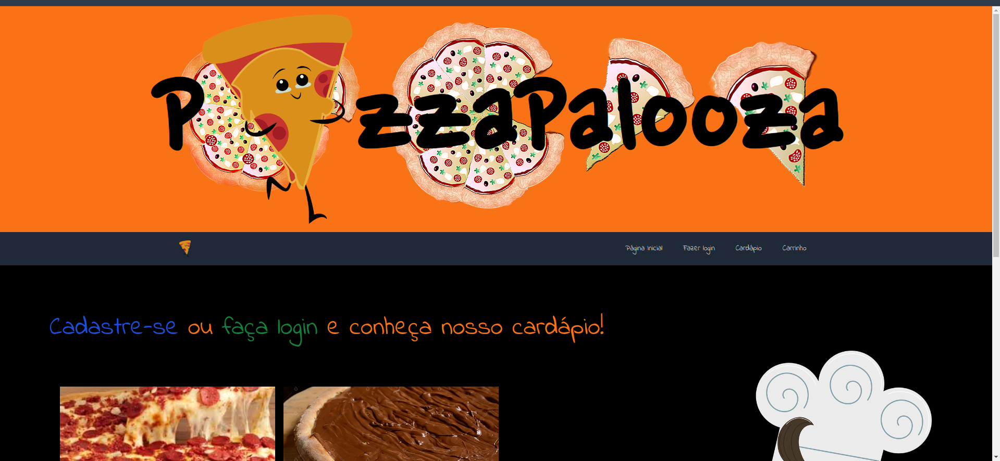
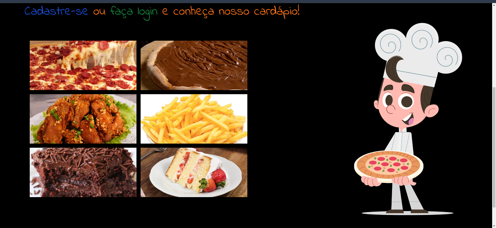
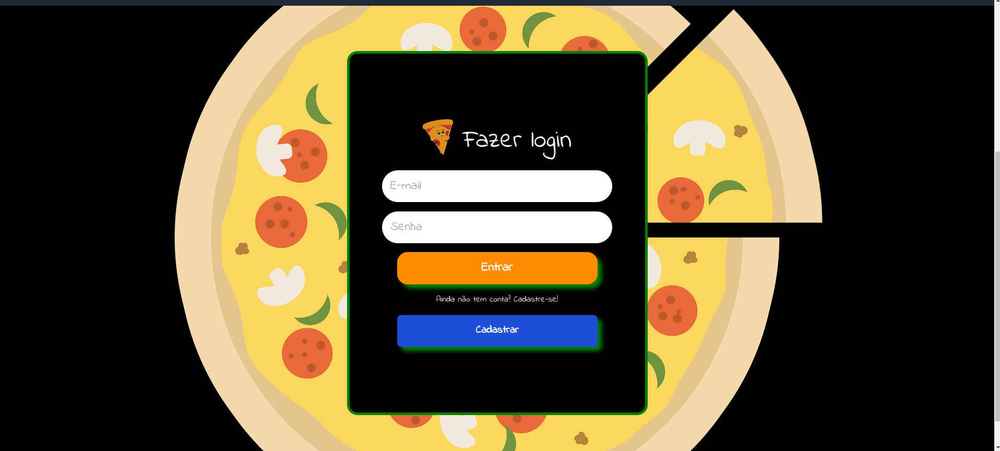
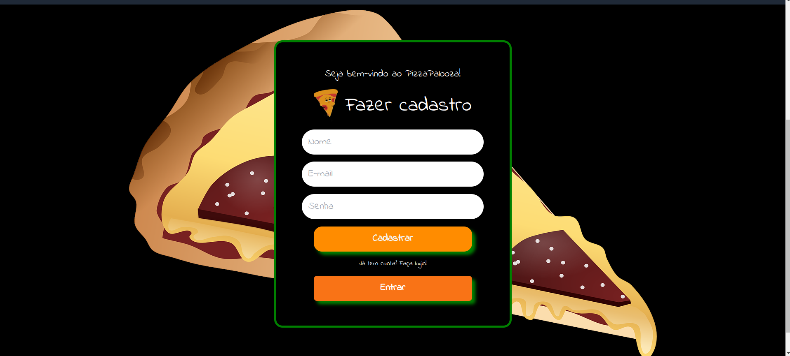
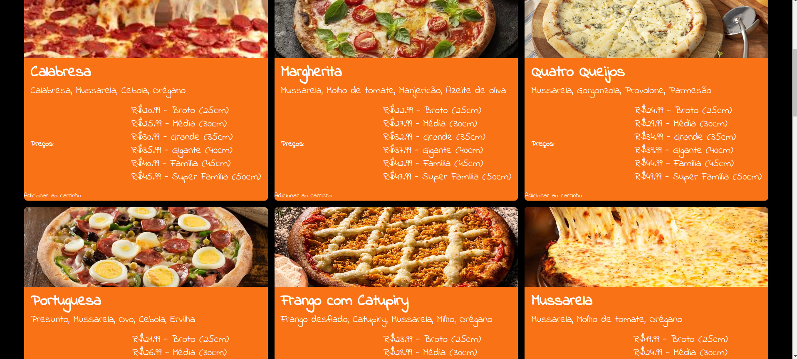
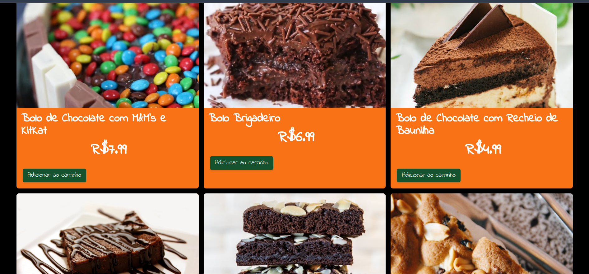
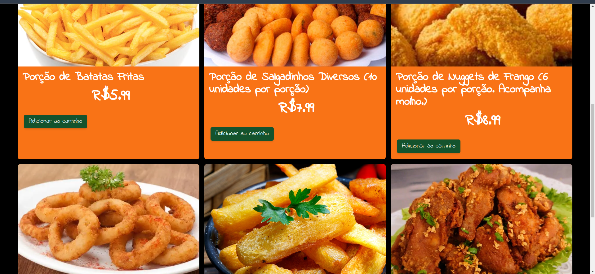
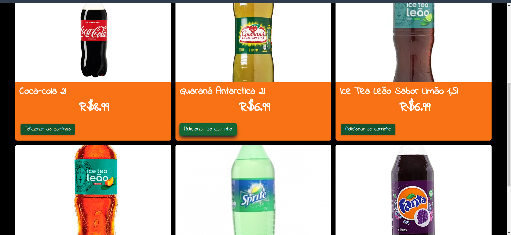
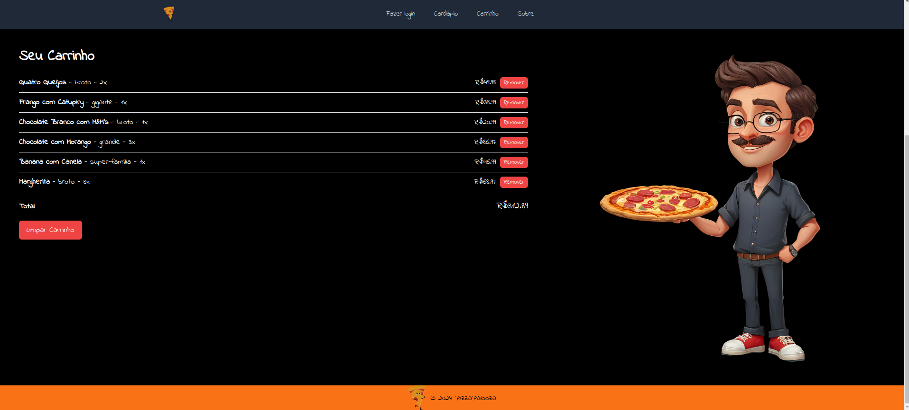
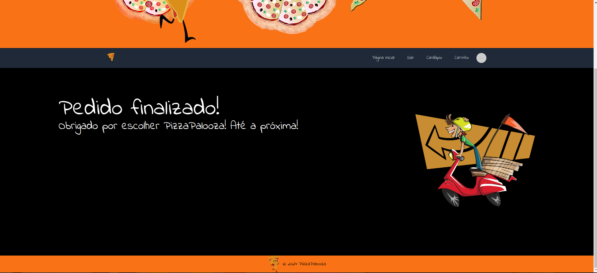

# PizzaPalooza

Aplicação de uma pizzaria onde é possível visualizar o cardápio e adicionar/remover produtos do carrinho.

### Tecnologias utilizadas
- React.js
- JavaScript
- Tailwind CSS

### Como rodar este projeto
É necessário ter o [Node](https://nodejs.org/en) instalado na sua máquina.
1. Faça o clone deste repositório
```bash
git clone https://github.com/carolcampos22/pizzaria-app.git
```
2. Entre na pasta do projeto
```bash
cd pizzaria-app
```
3. Instale as dependências
```bash
npm install
```
4. Abra-o no navegador
```bash
npm start
```
A página inicial será aberta na porta localhost:3000.

### Layout
1. Header


2. Página inicial


3. Login


4. Cadastro


5. Menu de pizzas


6. Menu de Sobremesas


7. Menu de Aperitivos


8. Menu de Bebidas


9. Carrinho de compras


10. Finalização da compra


### Site
Você pode acessar o site [neste link](https://pizzaria-app-seven.vercel.app/).

### Autora
#### Carolina Mendes - Desenvolvedora Web

[](https://www.linkedin.com/in/dev-carolina-mendes/)
