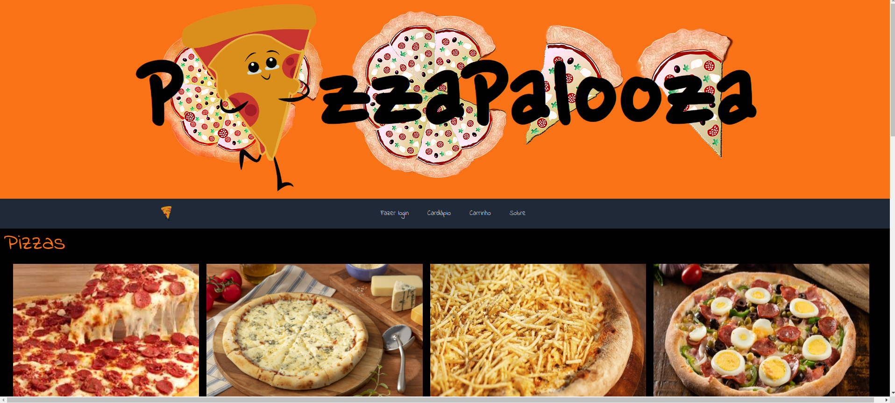

# PizzaPalooza

Aplicação de uma pizzaria onde é possível visualizar o cardápio e adicionar/remover produtos do carrinho.

### Tecnologias utilizadas
- React.js
- JavaScript
- Tailwind CSS

### Como rodar este projeto
É necessário ter o [Node](https://nodejs.org/en) instalado na sua máquina.
1. Faça o clone deste repositório
```bash
git clone https://github.com/carolcampos22/pizzaria-app.git
```
2. Entre na pasta do projeto
```bash
cd pizzaria-app
```
3. Instale as dependências
```bash
npm install
```
4. Abra-o no navegador
```bash
npm start
```
A página inicial será aberta na porta localhost:3000.

### Layout
1. Página inicial


2. Login


3. Cadastro


4. Menu de pizzas


5. Menu de Sobremesas


6. Carrinho de compras


7. Finalização da compra


### Próximos passos
- Adicionar a funcionalidade de adicionar produto ao carrinho na página de Sobremesas
- Páginas de Bebidas e Aperitivos

### Autora
#### Carolina Mendes - Desenvolvedora Web

[](https://www.linkedin.com/in/dev-carolina-mendes/)
