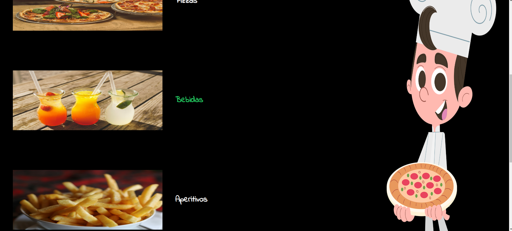

# PizzaPalooza

Aplicação de uma pizzaria onde é possível visualizar o cardápio e adicionar/remover produtos do carrinho.

### Tecnologias utilizadas
- React.js
- JavaScript
- Tailwind CSS

### Layout
1. Página inicial

2. Login

3. Cadastro

4. Cardápio

5. Menu de pizzas

6. Carrinho de compras

### Próximos passos
- Página de outros produtos
- Transformação CSS para animar a interação do usuário durante a seleção de produtos
- Utilizar propriedades CSS para controle de transições, proporcionando uma experiência suave ao adicionar ou remover itens do carrinho
- Permitir aos usuários revisar o pedido, ajustar as quantidades e finalizar a compra
- Autenticação de usuário com Redux
- Integrar atributos ARIA para melhorar a acessibilidade da aplicação, tornando-a mais amigável para usuários com deficiência.
- Footer
